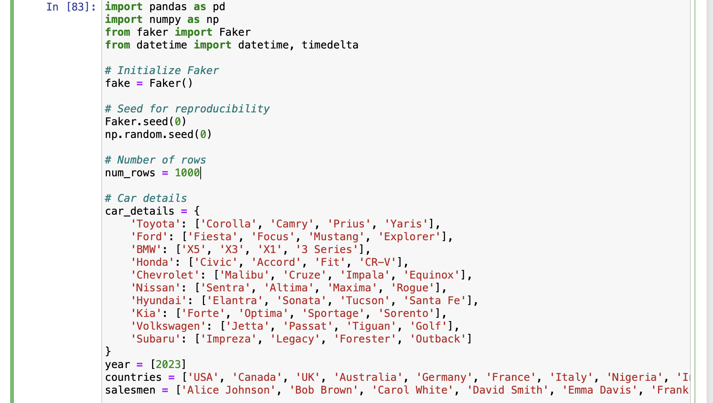
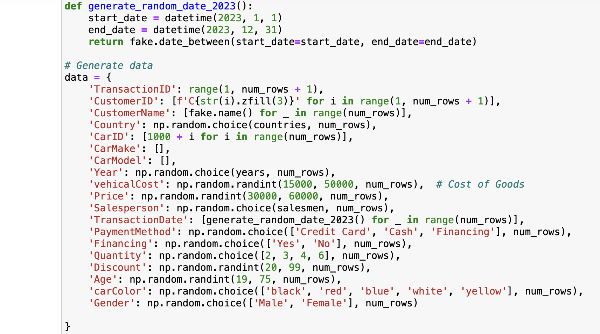
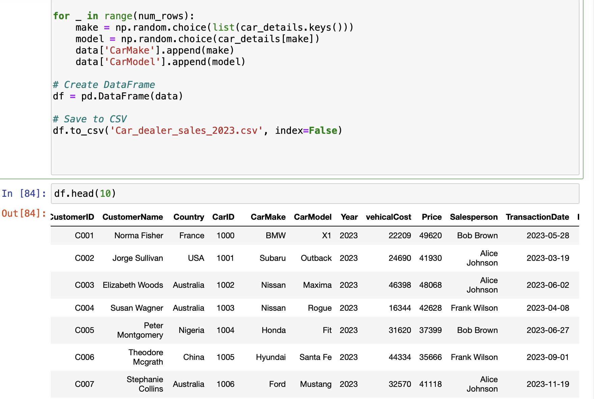
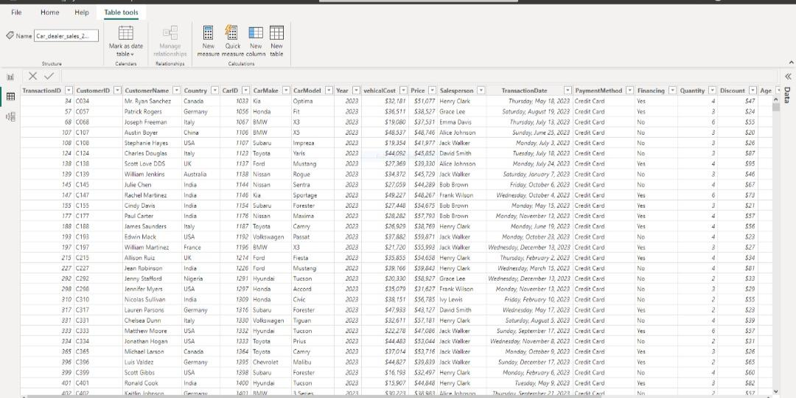
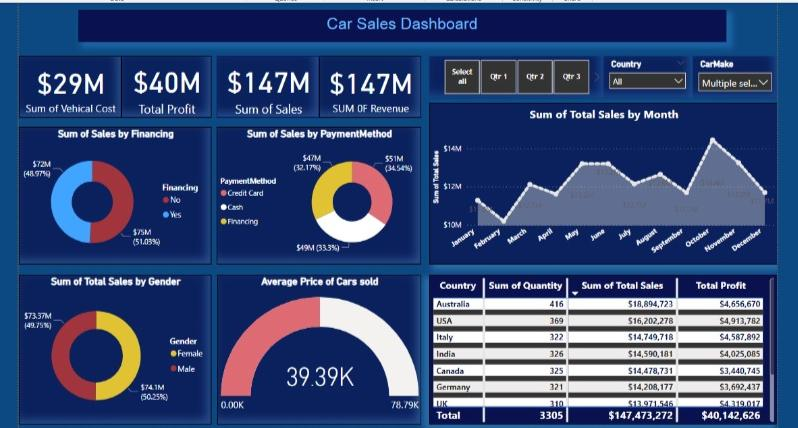

# Car sales analysis
 

## Introduction to the Power BI Project: Analyzing Synthetic Business Data. 

In this project, we will explore and analyze a synthetic dataset generated using Python's Faker library. The dataset is designed to simulate a real-world business scenario, providing a rich set of data points across various domains such as customer demographics, transactions, sales, and more. This synthetic data is valuable for practicing data analysis and visualization techniques in Power BI, as it mimics the complexities and patterns found in real-world business data.

The goal of this project is to demonstrate the application of Power BI in deriving meaningful insights from the generated data. By utilizing Power BI's powerful data transformation, visualization, and analytical capabilities, we will create interactive dashboards that provide key performance indicators (KPIs) and uncover trends that can drive business decisions. 
## Dataset Overview

The dataset includes various business-related fields as:
- customer information: Names, and associated customer IDs.
- Transaction Details: Product names, categories, prices, and stock levels.
- Sales data: Channels, regions, and sales performance metrics
- Employee Data: Employee names.

## Project Objectives

1. Data Cleaning and Transformation: The project will start with loading the synthetic dataset into Power BI, followed by data cleaning and transformation to ensure the data is in the correct format for analysis. This step includes handling missing values, creating calculated columns.
2. KPI Identification and Calculation: We will identify key performance indicators relevant to the business scenario, such as total sales, customer acquisition rates, average transaction values. These KPIs will be calculated using DAX (Data Analysis Expressions) in Power BI.
3. Interactive Dashboard Creation: Using Power BI's visualization tools, we will create an interactive dashboard that allows users to explore the data from different angles. The dashboard will include charts, graphs, and tables that present the data in an easy-to-understand format, allowing users to drill down into specific areas of interest.
4. Insights and Analysis: The final part of the project will focus on interpreting the visualizations and deriving actionable insights from the data. We will identify trends, patterns, and anomalies that can inform strategic business decisions.

## Methodology

This project Employes different Python libraries(to generate a synthetic data) and Power BI, for a car company. the analysis will provide actionable insights that will help the company improve. 

## Generating Data. 
 

 

 

## view of the data in Power BI 

 

## Power BI Dashboard 

## Conclusion

This Power BI project showcases the end-to-end process of data analysis, from data generation to insight generation. By working with a synthetic dataset, we can simulate the challenges and opportunities presented by real-world business data, making this an excellent learning experience for anyone looking to enhance their data analysis and Power BI skills.

